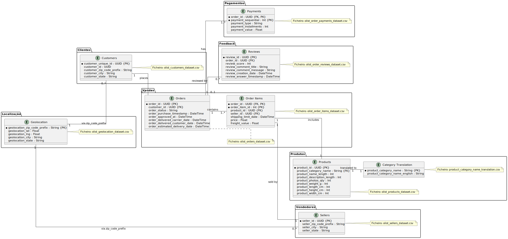

# Teste Técnico – Programa Trainee triggo.ai de Excelência em Engenharia de Dados e DataOps 2025

## Objetivo

Analisar o conjunto de dados históricos de vendas (Olist Brazilian E-commerce) para extrair insights de negócio e construir dashboards interativos que apoiem decisões estratégicas.


## Estrutura do Repositório
```
triggo.ai/
├── data/
│ ├── olist_customers_dataset.csv
│ ├── olist_geolocation_dataset.csv
│ ├── olist_order_items_dataset.csv
│ ├── olist_order_payments_dataset.csv
│ ├── olist_order_reviews_dataset.csv
│ ├── olist_orders_dataset.csv
│ ├── olist_products_dataset.csv
│ ├── olist_sellers_dataset.csv
│ └── product_category_name_translation.csv
├── notebooks/
│ ├── Triggo_ai.ipynb
├── requirements.txt
└── README.md
```

**Nota:** A pasta `data/` deve conter apenas os CSV originais.


## Como Executar

1. **Clonar o repositório**  
   ```bash
   git clone https://github.com/paula-marisa/triggo.ai.git
   cd triggo.ai

2. **Instalar dependências**
   ```bash
   pip install -r requirements.txt

3. **Executar os notebooks**

   3.1. **Iniciar o Jupyter Lab**
      ```bash
      jupyter lab

4. **Servir dashboards**
   ```bash
   pip install voila
   pip install pandas numpy scikit-learn matplotlib seaborn statsmodels voila ipykernel
   python -m ipykernel install --user --name python3 --display-name "Python 3"
   python -m notebook trust notebooks/triggo_ai.ipynb
   python triggo_ai.py
   python -m voila --debug notebooks/triggo_ai.ipynb

## Descrição do Notebook

### 1. Preparação dos Dados
* Importar os arquivos CSV do dataset
* Realizar a limpeza necessária (tratar valores nulos, remover duplicatas, etc.)
* Fazer a normalização de colunas quando necessário
* Criar um modelo relacional e conectar as tabelas adequadamente
* Descrever os passos de preparação dos dados adotados

### 2. Análise Exploratória de Dados
Resposta às seguintes perguntas utilizando SQL e Python:
* Qual o volume de pedidos por mês? Existe sazonalidade nas vendas?
* Qual a distribuição do tempo de entrega dos pedidos?
* Qual a relação entre o valor do frete e a distância de entrega?
* Quais são as categorias de produtos mais vendidas em termos de faturamento?
* Quais estados brasileiros possuem o maior valor médio de pedido?

### 3. Solução de Problemas de Negócio
Resolução das seguintes questões de negócio:
* Análise de Retenção: Calcular a taxa de clientes recorrentes. Considerar um cliente recorrente aquele que fez mais de um pedido no período analisado. Quais insights podemos extrair destes dados?
* Predição de Atraso: Criar um modelo simples para prever se um pedido será entregue com atraso.
   * Definir o que seria um pedido atrasado (baseado nas colunas disponíveis)
   * Usar os campos relevantes para criar features para seu modelo
   * Dividir o dataset em treino e teste
   * Implementar um modelo de classificação simples (pode usar Regressão Logística, Random Forest ou outro de sua escolha)
   * Avaliar a performance do modelo e explique os resultados
* Segmentação de Clientes: Utilizar técnicas de clustering para segmentar os clientes em grupos. Analisar o comportamento de cada grupo e sugira estratégias de marketing específicas para cada um.
* Análise de Satisfação: Explorar a relação entre a nota de avaliação dos clientes e diferentes aspectos como categoria do produto, tempo de entrega, valor do pedido, etc. Identificar fatores que mais impactam na satisfação do cliente.

### 4. Visualização e Dashboards
Criar visualizações e dashboards que respondam às seguintes necessidades:
* Um dashboard geral que mostre a evolução das vendas ao longo do tempo, com filtros por estado e categoria de produto
* Um mapa de calor mostrando a concentração de vendas por região/estado do Brasil
* Um conjunto de gráficos que apresente a relação entre avaliação do cliente e tempo de entrega
* Um dashboard de análise dos vendedores, mostrando quais têm melhor desempenho em termos de volume de vendas, satisfação do cliente e tempo de entrega

##  Principais Dependências
O ficheiro requirements.txt inclui as dependências necessárias para o porjecto.

## Modelo relacional
